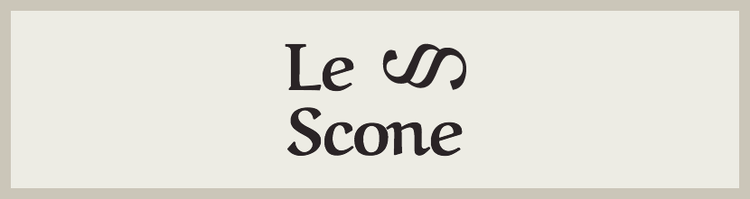

  

# Le Scone 🥐🥪

This project is a landing page of a fictional restaurant called Le Scone and was developed to put into practice the knowledge acquired during the "CSS with SASS" Course from [Origamid](https://www.origamid.com/), a Brazilian learning platform.

The page is responsive and contains three main sections and a footer:

- Hero: contains the logo, the page's main image, and information about the restaurant's opening hours and location
- Menu: menu of the food served in the restaurant, with prices and images
- Contact: contact form and embedded google maps

## Link

- Live Site URL: [Le Scone](https://julianachagas.github.io/le-scone/)

## Technologies

- HTML
- CSS/SASS

## My Process

### Built with:

- Live Sass Compiler Extension by [Glenn Marks](https://github.com/glenn2223/vscode-live-sass-compiler)
- Sass mixins (typography and media queries)
- Sass functions (define grid columns)
- Sass variables (colors and fonts)
- Mobile-first workflow
- Semantic HTML5 markup
- CSS Flexbox
- CSS Grid

## Layout

### Web 🖥️

   

### Mobile 📱

   

## Useful Resources

- [Sass, BEM, & Responsive Design](https://youtu.be/jfMHA8SqUL4) by Coder Coder

- [Sass Tutorial: CSS With Superpowers](https://youtu.be/_a5j7KoflTs) - freeCodeCamp

- [Sass Guidelines](https://sass-guidelin.es/) by Kitty Giraudel

## Author

- LinkedIn - [Juliana Chagas](https://www.linkedin.com/in/juliana--chagas/)
- Twitter - [@JulianaCoding](https://twitter.com/JulianaCoding)

 

---

##### Made with 💜 by Juliana Chagas
